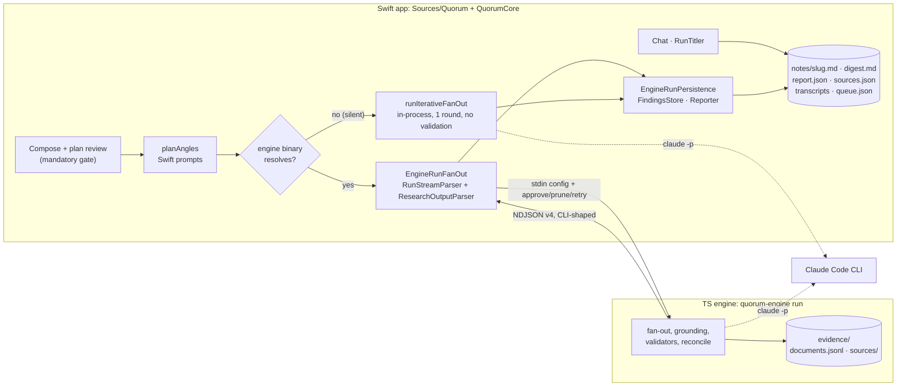
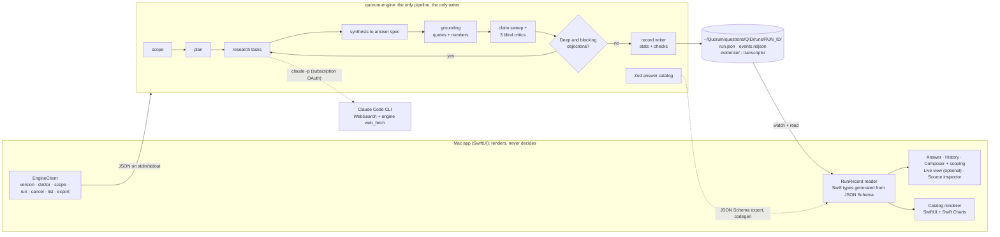
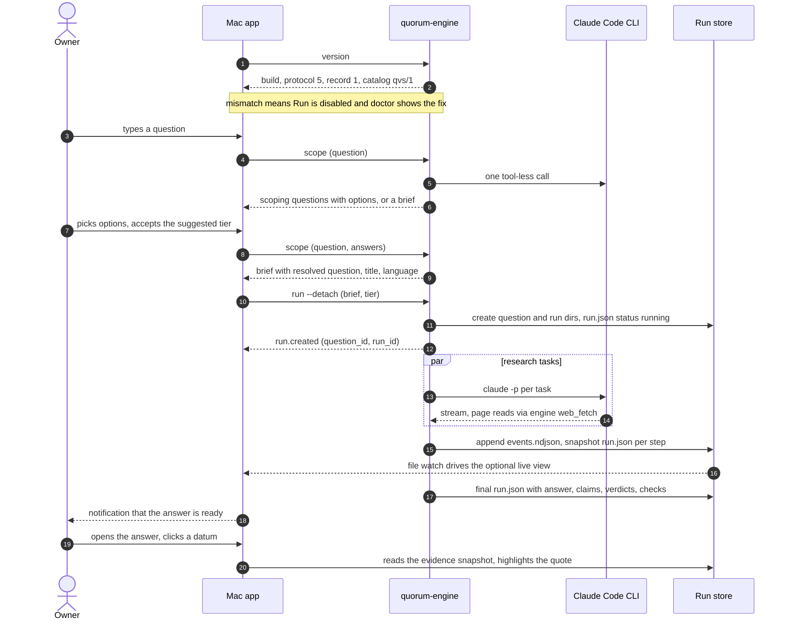
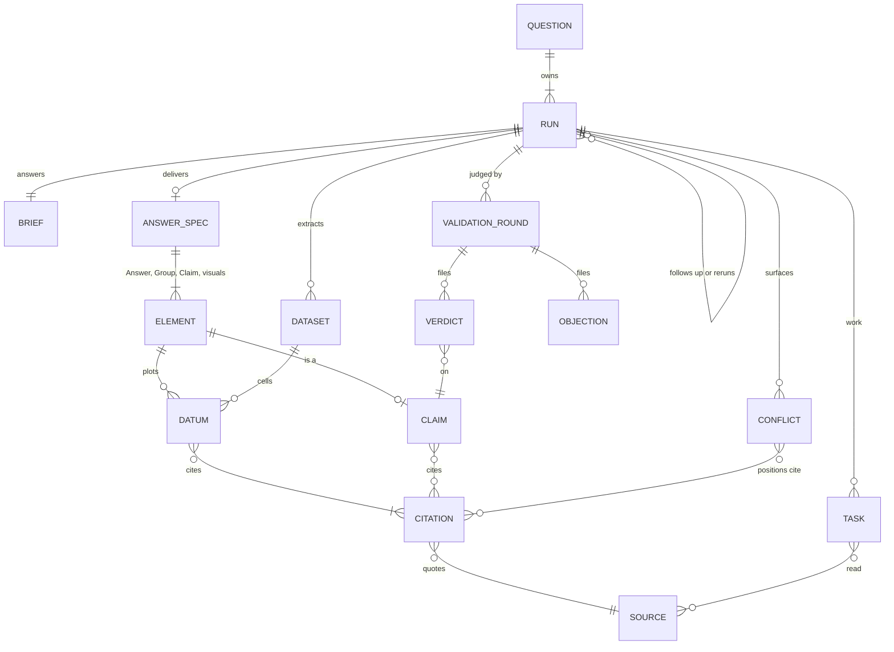
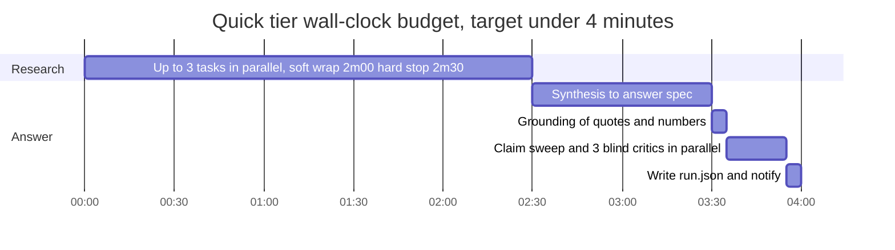
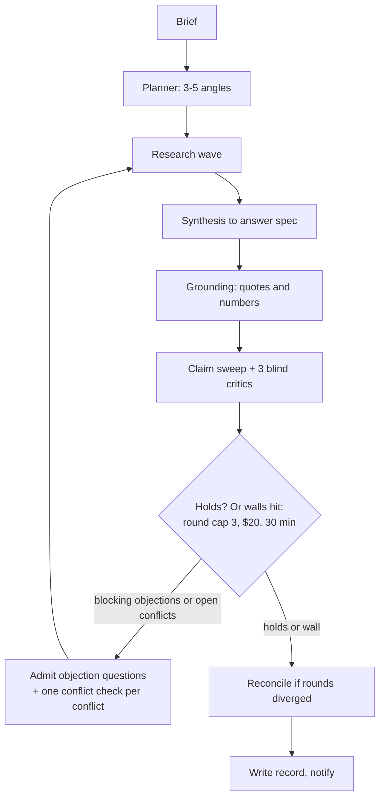
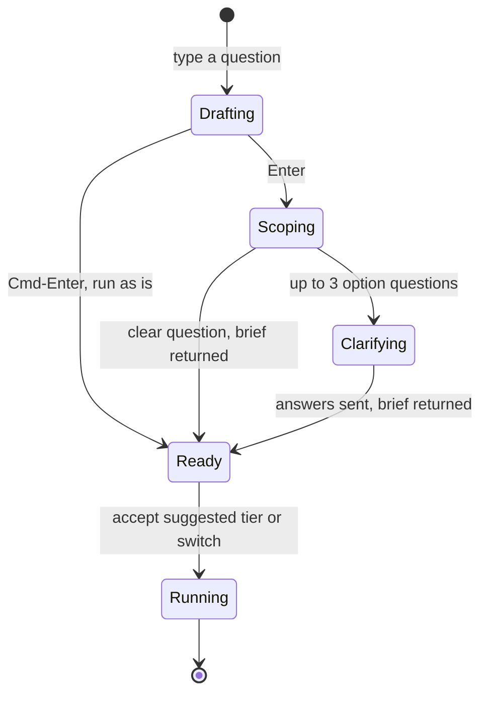
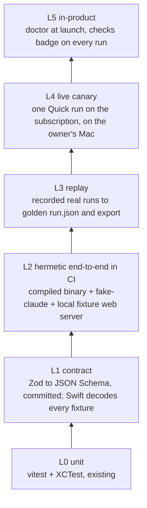
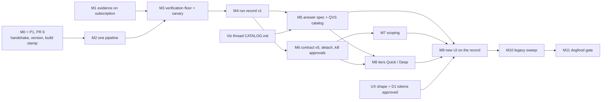

# PRD 10: Architecture rethink. One engine, one record, one contract

**Status:** proposal, not implemented · **Date:** 2026-10-09 · **Branch:** `dogfood/arch-rethink`
**Supersedes, once accepted:**
- PRD 02's run profiles (frozen)
- PRD 04's human approvals and agent-initiated spawning (deleted)
- PRD 08's plan review on the canvas (deleted)
- PRD 09's graph-first reading (answer-first now)
- The append-to-note "brain" writer from PRD 00 (frozen)

**Inputs:**
- `RUN-VALIDATION-2026-08-10.md`
- PRDs 00–09
- Code on `main` at `4f16287`
- UX thread: `docs/ux-rethink/AUDIT.md` and `docs/ux-rethink/PROPOSAL.md` on `origin/dogfood/ux-rethink` (shape C, an inbox of questions)
- P1 thread: `docs/reliability/p1-findings.md` on `origin/dogfood/p1-reliability` (PR #6)
- Viz thread: `design/viz/CATALOG.md` (QVS v1, in its worktree; `RECOMMENDATION.md` not written yet)
- Owner decisions of 2026-10-09: dogfood-first; trust plus a beautiful answer is the moat; native rendering of visual components (option b)

**Positioning → architecture.** Parallel fan-out is a commodity (Manus Wide Research, ChatGPT and Gemini deep
research). Quorum's moat is **trust**: claims you can verify. The other half is **a beautiful answer**. So the
fan-out should be kept boring: no human gates, no dynamic spawning, a fixed tier recipe. Engineering goes into
evidence capture, deterministic checks, blind critics, the answer format and the source inspector. Each of
those is a single, engine-owned, testable thing below.

> **Reading guide.** Each of the seven questions gets its own section, which opens with **Recommendation** and then
> covers the trade-offs. §0 explains why the system can't be trusted today. §8 lists the decisions only the owner can make.

---

## TL;DR

1. **There is one pipeline, and it is the engine.** Delete the Swift in-process fallback (`runIterativeFanOut`) and
   every Swift copy of pipeline logic: prompts, planner, output parser, presets and quote matching. If no
   compatible engine is found, the app runs nothing. It never runs a degraded pipeline.
2. **The engine is the only writer.** Each run is one directory holding `run.json`, the canonical record, and
   `events.ndjson`, an append-only log. Every surface derives from the record: the answer, claims, citations, sources,
   verdicts, conflicts, visuals, cost, timeline, the graph and the markdown export. The Swift app writes nothing about a run.
3. **The contract is small and versioned four ways.** Nine commands: `version`, `doctor`, `scope`, `run`, `cancel`,
   `list`, `export`, `check` and `migrate`. A short liveness event stream. Exact protocol match. The engine build stamp
   is written into every record. The answer catalog is versioned separately. A stale engine can no longer run silently:
   it either matches, or the Run button says why it can't.
4. **Every subscription run gets verifiable evidence.** Keep Claude's built-in `WebSearch` for discovery, but route
   every page *read* through the engine's own keyless `web_fetch`. Today a keyless subscription run captures nothing,
   so the claim sweep is skipped *by design*. P1's live run confirmed it: the crew ran, then ended `inconclusive` on
   "no evidence captured". **Every keyless subscription run ends that way until this lands.**
5. **The deliverable is one catalog-constrained spec.** The answer is a QVS v1 spec (the Viz thread's catalog,
   json-render-shaped): a lead, 1–4 groups of `Claim`s, and at most 3 visuals. Every number is a `Datum` with
   `cite` ids. The engine validates the structure with Zod, then adds `trust` to every datum and claim, including a
   deterministic "is this number in the quote?" check.
6. **The answer is rendered natively (owner decision b).** SwiftUI plus Swift Charts render the stored spec,
   using Swift types generated from the engine's exported JSON Schema. The app stays a *pure renderer*: it holds no
   domain logic.
7. **Kill the human-in-the-loop machinery and the side projects.** That covers plan review, spawn approvals, agent
   spawning, stdin controls, `PendingApprovals`, post-run Chat, the Benchmark, the dry-run executor, presets,
   templates and model pickers. Freeze BYOK/Codex inside the engine only. About **4.5k Swift source lines and 2.5k
   test lines are deleted outright**.
8. **Tiers live in the engine**, and `tier: quick|deep` is the only knob the app sends. Scoping is an engine command.
   Its `Brief` is the run's only input and the source of the question's title.
9. **Never-run-live becomes impossible to merge.** That takes four things:
   - CI runs the engine tests and a compiled-binary end-to-end run.
   - Fixtures expire when any version bumps.
   - A live Quick canary on the subscription gates every engine-path PR.
   - Every run carries machine-checked integrity checks.
10. **Migration is 10 steps (M1–M10) plus the dogfood gate (M11).** The first three are small and land the biggest
    trust wins. They build on P1's handshake (PR #6). §7.3 maps each P1 fix to its fate, so nothing gets extended
    that a later step deletes.

---

## 0. Diagnosis: why a run can't be trusted today



| Symptom (RUN-VALIDATION) | Root cause found in code | Structural fix here |
|---|---|---|
| §2: the v4 validator crew didn't run; single-shot synthesis | **Confirmed by P1** (`p1-findings.md`): <ul><li>The run never reached the engine. Its artifacts carry Swift UUIDs, a `rateLimit` field and no `evidence/`.</li><li>Under `swift run`, `QuorumEngine.resolvePath()` looked only at `QUORUM_ENGINE_BIN` (unset) and `Bundle.main` (`.build/debug`, empty). No script builds an `.app` with the engine inside.</li><li>So `AppModel.swift:537-593` took `runIterativeFanOut(maxRounds: 1)` behind only a non-blocking banner.</li><li>It would have failed anyway. The only binary, `engine/dist/quorum-engine` (Jul 15), speaks **protocol v1**, and the handshake tolerated older versions.</li></ul> | One pipeline (M2); exact handshake plus build stamp (§1.5; P1 landed the probe); dev runs the engine from source |
| §3: no evidence snapshots on the subscription path | Grounding is gated on a **search key**, not on `evidenceDir` (`config.ts:8-14`). With no key, `claudeCode.ts:87` hands the CLI built-in `WebFetch`, which keeps nothing. The result is `grounding:"none"` → the claim sweep is skipped (`validate.ts:103`) → `unvalidated`. Fetching needs no key (Jina Reader, keyless). | Hybrid tools (M1, §1.6) |
| §3: dangling `[^id]` in notes | Two writers. The engine appends footnote definitions to its writeup. The Swift fallback and the note writer don't. | Engine-only export from the record (M4) |
| §4: `transcriptPath == notePath` | Swift reconstructs transcripts from the stream | The engine writes `transcripts/` itself (M4) |
| §5: source counts disagree (3 vs 17 vs 20 vs ~45) | `sourcesConsulted` appears **68 times** in Swift. Some places use the model's self-reported number (`ResearchOutputParser:172`, `RunStreamParser:113`, `Supervisor:71`); others recompute (`Reporter.distinctSources`). | `stats` is computed once, by the engine, at write time (§2.4) |
| §1: runs titled after the clarifier | No scoping step, so the model's urge to clarify leaks into the run, and a Haiku titler reads its reply (`Chat.swift:533`) | Scoping before the run; title = `brief.title` (M7) |
| §7: round 2 never fired | The fallback hard-codes `maxRounds: 1`, and presets live only in Swift (`GuardrailMapper`) | Tiers in the engine (M8) |
| "Never run live / never visually confirmed" | <ul><li>CI runs only `swift test`. The 350 engine tests never run in CI.</li><li>No test touches the real binary, the CLI or `index.ts`.</li><li>Engine run fixtures are overwritten rather than compared.</li><li>The Swift fixture copies are still protocol v3.</li></ul> | Verification ladder (§6) |

**Four structural causes**, which everything below attacks:

1. **Two pipelines.** The fallback can't validate, so every path that reaches it quietly breaks the product promise.
2. **Logic duplicated across the language boundary**, which drifts:
   - prompts (`ResearchPrompts.swift` vs `systemPrompt.ts`)
   - the planner, which lives only in Swift even on the engine path
   - presets
   - output parsing
   - quote matching (`QuoteLocator` vs `evidence.ts`)
   - graph derivation
   - fixtures
3. **The stream is the contract.** Every consumer reassembles the run's state from events shaped like the Claude CLI
   (`PROTOCOL.md` is still "consumable UNCHANGED by the Swift ResearchOutputParser"). The final state lives nowhere.
4. **Six artifacts per run from five writers:** digest, report, sources.json, the note plus frontmatter, transcripts and
   evidence. No one of them is authoritative.

---

## 1. Where the pipeline lives, and the app ↔ engine contract

### 1.1 Recommendation

**The engine is the only pipeline *and* the only writer of run state. The Swift app renders records and invokes commands.**

| Option | Verdict | Why |
|---|---|---|
| **A. Engine only** (recommended) | ✅ | <ul><li>The validator crew, evidence, reconciliation and 350 tests already live there.</li><li>One prompt set, one parser and one matcher.</li><li>Any future renderer (a share page, the product phase) reads the same record.</li></ul> |
| B. Move everything back into Swift | ❌ | Re-ports ~2.5k lines of tested TS: validate, evidence, run loop. Loses the Zod/AI-SDK ecosystem, which visual-catalog validation needs. |
| C. Keep both, with a loud badge (P1's §2 stop-gap) | ❌ long-term | An unvalidated answer is exactly what the product promises *not* to give. Every change lands twice: P1 just had to make the language fix in both pipelines and pin it with a cross-language `prompt-contract.json`. |

**Trade-offs of A, and how to mitigate them:**
- **Dev needs the engine.** Mitigation: in a repo checkout the app runs the engine **from source**
  (`bun engine/src/index.ts`), so it can never be stale.
- **The offline demo and dry run lose `DryRunExecutor`.** They get an engine-side replay backend instead
  (`run --replay <fixture>`), so dry runs exercise the real orchestration code.
- **The Benchmark depends on `runIterativeFanOut`.** It goes in the same step. Tag it first
  (`git tag benchmark-v1`) so it can be resurrected later as an engine `bench` command over records.

### 1.2 Who owns what

| Engine owns | App owns | App never does |
|---|---|---|
| <ul><li>Scoping and planning</li><li>Research tasks and evidence capture</li><li>Quote location and numeric tracing</li><li>Synthesis into the answer spec (QVS) and catalog validation</li><li>The validator crew, the loop and reconciliation</li><li>Tier definitions; one prompt set, language-aware</li><li>Writing the record, stats and checks</li><li>Export, migrations and `doctor`</li></ul> | <ul><li>Windows, keyboard and ⌘K</li><li>Rendering the record: answer, visuals, sources, live graph, history</li><li>The source inspector (PDFKit / snapshot)</li><li>Notifications, menu bar and Dock</li><li>The power assertion</li><li>Invoking commands and watching the store</li><li>Its few settings: store location, notifications</li></ul> | <ul><li>Build a prompt</li><li>Parse model output</li><li>Count anything</li><li>Pick a title</li><li>Match a quote</li><li>Write into a run directory</li></ul> |

### 1.3 Target shape



### 1.4 Commands (protocol v5)

All commands are JSON in, JSON out. They are the *whole* surface: no stdin control channel stays open during a run.

| Command | Input | Output | Notes |
|---|---|---|---|
| `version` | none | `{engine_version, build, protocol, record_schema, catalog}` | P1 added this (PR #6, `emitter.ts versionLine`). Extend it with `record_schema` and `catalog`. |
| `doctor [--json]` | none | `{checks:[{id, ok, detail, fix}]}` | <ul><li>claude CLI found, version, logged in</li><li>fetch reachable</li><li>store writable</li><li>records needing `migrate`</li><li>last-known rate-limit window</li></ul> |
| `scope` | stdin `{question, answers?, parent_run_id?}` | <ul><li>**Either** `{needs_scoping: true, questions:[{id, text, multi, options:[{id, label, key}]}], proposed_resolved, suggested_tier, title, language}`</li><li>**Or** `{needs_scoping: false, brief}`</li><li>A second call with `answers` always returns a `brief`.</li></ul> | <ul><li>Stateless. The shape matches UX §6.3, whose option chips have keys.</li><li>One tool-less call on a fast model.</li><li>UX targets <2 s p50. Claude CLI startup alone is ~2–5 s, so measure it in M7 before designing around it.</li></ul> |
| `run --store DIR [--detach]` | stdin `{brief, tier, question_id?, kind: initial\|followup\|rerun, parent_run_id?}` | first line `run.created {question_id, run_id, dir}`, then liveness events | `--detach` returns after `run.created`; events go only to the file (§1.8). With no `question_id`, `run` creates the Question. |
| `cancel RUN_ID` | none | `{ok}` | SIGTERM to the process group → graceful wind-down → `halted` |
| `list --store DIR` | none | one index line per run | Also marks crashed runs (stale heartbeat, dead pid) |
| `export RUN_ID --format md [--out PATH]` | none | markdown | A pure function of `run.json` (§2.7) |
| `check RUN_DIR` | none | an invariant report | Used by the canary, CI and the app's integrity badge (§6) |
| `migrate --store DIR` | none | a report | Upgrades older record schemas in place |
| `mcp-serve` | internal | none | Tool server for CLI tasks (`web_fetch`, and `web_search` when a key exists) |
| `research` (single topic) | none | none | **Frozen**: only the BYOK `EngineExecutor` uses it |

**Liveness events (v5).** `run.json` is the truth; events exist only so a watcher feels the run move. Every line
carries `seq` and `t`.

| Event | Payload | Replaces |
|---|---|---|
| `run.created` | `question_id, run_id, dir, tier, title` | `run_start` |
| `run.progress` | `stage: research\|draft\|check\|answer, stage_index, stage_count, tasks_done, tasks_total, sources_read, eta_s` | `phase`. These are UX §6.3's user stages, with Scope as the composer's step 1. The engine maps its internal phases onto them. `eta_s` comes from the tier's median durations, recorded by past runs. Emitted on every change and at least every 10 s. |
| `finding` (optional) | `task_id, text (≤140 chars, answer language), url, host` | none. These are UX's "early findings": provisional, never cited, at most 1 per task per 30 s. They ship only if the owner wants them (UX question 4). |
| `task.started` / `task.finished` | `task_id, kind, title, round, status` | `angle_status`, `round`, `plan` |
| `activity` | `task_id, kind: search\|read\|write\|judge, label` (throttled to ≤4/s) | `stream_event` token deltas and CLI-shaped `assistant` lines |
| `source.captured` | `source_id, url, title, capture` | `document` |
| `record.updated` | `seq` | `graph_node`, `graph_edge`, `topic_result`. The app re-reads `run.json`, which carries the graph. |
| `run.finished` | `status` | `run_result` |
| `error` | `code, message, fatal` | `error` |

Dropping the CLI-shaped deltas ends the constraint that the engine's stream must be "consumable UNCHANGED by
ResearchOutputParser". That constraint is what kept 358 lines of Swift parsing alive on the engine path.

### 1.5 Versioning and handshake

There are four numbers, each with exactly one rule:

| Number | Where it appears | Rule |
|---|---|---|
| **Engine build** (`git sha[-dirty]`) | `version`; `run.json pipeline.build` | <ul><li>**Release:** must equal the build baked into the app's Info.plist. A mismatch means a broken bundle, so refuse.</li><li>**Dev:** shown in Settings, with a warning when it isn't HEAD.</li></ul> |
| **Protocol** (5) | `version`; `run.created` | **Exact match.** No "older is tolerated". Tolerating older versions is how a v1/v2 binary passed for v4. |
| **Record schema** (`quorum.run/1`) | `run.json schema` | The app reads exactly its major version. The engine's `migrate` upgrades old records in place. Additive fields are allowed within a major. |
| **Answer catalog** (`qvs/1`) | `run.json answer.catalog` | The app renders the components it knows. An unknown `type` renders its engine-written `fallback_md`, so the app never crashes and never shows a blank. |

**Failure modes, today vs proposed:**

| Situation | Today | Proposed |
|---|---|---|
| No engine | Silent in-process run, with an orange banner on Compose | Run disabled. A `doctor` panel shows the fix: "build the engine" in a dev checkout, "reinstall" in a bundle. |
| Older engine | Accepted; renders as "never validated" | Refused at the handshake, before anything spawns |
| Newer engine | Killed mid-stream after spawning | Refused at the handshake |
| Release bundle with mismatched build | Not detected | Refused (broken bundle) |
| Dev engine is dirty or behind HEAD | Invisible | Can't happen when running from source. A `QUORUM_ENGINE_BIN` override shows a banner with its build. |
| claude CLI missing or logged out | Fails per angle, mid-run | `doctor` fails before the run, with a fix |
| Engine crashes mid-run | Partial artifacts, with Swift guessing | `status: crashed` from the stale heartbeat. `events.ndjson` keeps everything up to the crash. |
| Reading blocked for a source (403 or paywall) | Silent | `source.capture: failed` plus a reason. Claims resting only on it render as "couldn't verify". |

### 1.6 Evidence on the subscription path (the single biggest trust fix)

`SearchClient.fetch` is keyless: it calls Jina Reader `r.jina.ai` and falls back to a plain fetch plus `stripHtml`.
Only `web_search` needs Tavily or Brave. The fix:
- In `claudeCode.ts:87`, split the `hasOwnSearch` gate:
  - Always allow `mcp__quorum__web_fetch`.
  - Allow `WebSearch` (built-in) when there's no search key.
  - Never allow the built-in `WebFetch`.
- `createMcpServer` registers `web_fetch` unconditionally, plus `web_search` when a key exists.
- `groundingTier` becomes a fetch-capability check, so `captured` is the norm and `none` is an incident. It is still
  reported per source.
- Port the 12 000-character `offset` paging to the MCP `web_fetch` (read parity currently holds only on BYOK).

The trade-offs, which are decision 2 in §8:
- Jina (a third party) sees every URL read, and the keyless tier is rate-limited. Direct fetch is the fallback but
  extracts worse (`degraded`).
- Built-in `WebSearch` result pages are unchanged. Only *reading* changes.

The alternative was to fetch cited URLs after the fact, during grounding. It was rejected: quotes the model copied
from built-in `WebFetch` output are often paraphrased, so they would mostly land as `fuzzy`/`unresolved`, and it
needs a new grounding tier.

### 1.7 Packaging

- **Dogfood = the shipped artefact, not `swift run`.**
  - A new `scripts/make-app.sh` (`.gitignore` already anticipates it) builds the app and the engine from one commit.
  - It bakes `QuorumEngineBuild` into Info.plist and builds the engine with `--define QUORUM_ENGINE_BUILD` (P1 added
    the define to `bundle-engine.sh`).
  - It copies the engine into `Contents/Resources` and codesigns both. To verify: Bun-compiled binaries under the
    hardened runtime may need JIT entitlements.
  - `scripts/install.sh` puts it in `/Applications`.
- **Dev resolution order:**
  1. `QUORUM_ENGINE_BIN`, handshake-checked.
  2. In a repo checkout with `bun` on PATH, `bun <repo>/engine/src/index.ts`.
  3. The bundle.
  - Never a silent fallback.
  - P1's `EngineResolution`/`EngineHandshake` (candidates plus rejection reasons) is the right core. Keep it, add the
    source candidate, and turn "fallback reason" into "refusal reason".
- **Settings → About** shows `engine 0.2.0 · build 4f16287 · protocol 5 · from source`.

### 1.8 Detached runs

`run --detach` starts the engine in its own session (`setsid`). A 20-minute Deep run then survives the app quitting,
crashing or being rebuilt. That's real during dogfooding, because the owner rebuilds the app while runs are going.
- `run.json` carries `pid` and a `heartbeat_at`, refreshed every 5 s.
- `list` and the app mark a run `crashed` when its heartbeat is stale and its pid is gone.
- The CLI children share the engine's process group, so `cancel` reaches all of them.
- The engine also spawns `caffeinate -i -w <pid>` so the Mac doesn't sleep mid-run. That replaces the app-held IOKit
  assertion for detached runs.

### 1.9 One run, end to end



---

## 2. One canonical run record

### 2.1 Recommendation

The record is **files, with the engine as the only writer**, in one brain folder the user owns. The layout adopts the
UX proposal's model (§6.1–6.2 there): a **Question** is the list row, and it owns 1..n **Runs** (initial,
follow-ups, re-runs).

```
~/Quorum/                          # brain folder, chosen once (UX F1). Not the code repo; no "project" concept.
  questions/<question_id>/         # ULID; folder names never carry titles
    question.json                  # engine-written: original text, scope answers, resolved text, title, language, run ids
    runs/<run_id>/
      run.json                     # THE record: schema quorum.run/1, rewritten atomically (tmp + rename)
      events.ndjson                # append-only liveness log: replay, debugging, crash forensics
      evidence/documents.jsonl     # unchanged from PROTOCOL v2/v3
      evidence/sources/<id>.md|.pdf
      transcripts/<task_id>.ndjson # raw CLI stream per task, written by the engine
  answers/<slug>.md                # markdown export, regenerated on every finish (UX §6.2)
  ui-state.json                    # app-owned: read markers, collapsed follow-ups. Never run data.
```

Renaming a question never moves files, which retires the class of bugs behind `ensureTitles` and `RunTitler`
renaming folders. The app writes exactly one file, `ui-state.json`, and nothing in it describes a run.

**Files vs SQLite.** Files are the truth. At dogfood scale (tens to hundreds of questions), `list` reads
`question.json` plus the latest `run.json` header in milliseconds. A SQLite FTS index over answer text and quotes
is a disposable *cache* for UX's ⌘K "inside answers / sources" search, and later for the brain. It can always be
rebuilt from the folders. SQLite as the truth would cost the "files you own" property and inspectability for no
current gain.

### 2.2 Schema sketch

The source is Zod in `engine/src/record/`. The exported JSON Schemas go to `schema/*.schema.json`, and the Swift
types are generated from them.

```ts
Question {
  schema: "quorum.question/1"
  id; created_at; original_text; language
  scope?: { questions: ScopeQuestion[]; answers: Record<string, string[]>; free_text? }
  resolved_text; title                 // title comes from scope/resolve, NEVER from a run's model output
  run_ids: string[]                    // ordered: initial, follow-ups, re-runs
  topic_id?                            // reserved for the brain
}
RunRecord {
  schema: "quorum.run/1"
  id; question_id; kind: "initial"|"followup"|"rerun"; parent_run_id?
  created_at; updated_at; finished_at?
  status: "running"|"complete"|"inconclusive"|"halted"|"failed"|"cancelled"|"crashed"
  status_note?: string                 // which wall stopped it, in words
  tier: "quick"|"deep"                 // "wide" reserved (§4.4)
  brief: Brief                         // the run's ONLY input (§4.2)
  pipeline: { engine_version; build; protocol; backend: "claude-code";
              models: { planner?; research; synthesis; validator };
              grounding: "captured"|"partial"|"none"; pid?; heartbeat_at? }
  answer?: Answer                      // the deliverable, a QVS v1 spec (§2.3)
  claims: Claim[]                      // one per Claim element in the answer, plus each angle's findings
  citations: Citation[]; sources: Source[]
  conflicts: Conflict[]; gaps: Gap[]
  validation: { status: "validated"|"unvalidated"; holds: boolean;
                rounds: ValidationRound[]; objections_open: Objection[] }
  open_items: { conflicts: string[]; objections: string[]; gaps: string[]; failed_tasks: string[] }   // ids; UX "Open items"
  tasks: Task[]                        // angles, objection follow-ups, conflict checks, (future) Wide items
  datasets: Dataset[]                  // structured cited extractions that visuals can bind to (Wide-ready)
  graph: { nodes: Node[]; edges: Edge[] }   // the orchestrator's own graph, for "Show the work" (G)
  cost: { usd_notional; cap_usd; by_role: Record<Role, number>;
          rate_limit?: { window; status; resets_at } }
  timeline: { at; stage; phase }[]
  stats: Stats                         // computed ONCE by the engine; readers never count
  checks: Check[]                      // integrity invariants evaluated at finish (§2.4)
}
Claim    { id; text; confidence: "high"|"medium"|"low"|"unverified"   // model-proposed, engine-floored
           reason?; citation_ids: string[]
           strength: "solid"|"shaky"                                 // UX gutter. Engine rule: located + supported +
                                                                     // (≥2 independent sources or one primary)
           verdict?: { verdict: "supported"|"unsupported"|"misquoted"|"unjudged"; severity?; reason? }
           element_id?; task_ids: string[]; round: number }
Citation { id; source_id; quote; match: "exact"|"normalized"|"fuzzy"|"unresolved"; start?; end?; page? }
Source   { id; url; host; title; content_type; quality?: "primary"|"company"|"vendor_seo"|"panel"|"unknown"
           capture: "ok"|"degraded"|"failed"|"none"; snapshot?; original?; fetched_at; read_by: string[]; cited: boolean }
Conflict { id; statement; positions: { text; citation_ids: string[] }[]; status: "open"|"settled";
           settled_in_round?; scope: "across_tasks"|"within_task" }   // fixes the "Angle 2 vs itself" copy bug
Task     { id; kind: "angle"|"objection"|"conflict_check"|"item"; title; prompt; round; status
           started_at; finished_at; cost_usd; transcript?; writeup?; source_ids: string[]; origin }
Stats    { claims; claims_solid; claims_shaky; claims_unverified; conflicts_open; sources_read; sources_cited
           visuals; datums_unverified; duration_s; rounds
           trust_level: "solid"|"moderate"|"shaky"|"unchecked" }    // UX trust strip; "unchecked" iff grounding none
```

There is **one definition of "sources"**:
- `sources_read` is the number of distinct documents captured.
- `sources_cited` is the number of distinct sources with at least one *resolved* citation in the answer.
- The UI says "12 cited · 45 read".
- The model's self-reported `sourcesConsulted` is dropped from the contract.

### 2.3 The answer: one catalog-constrained spec (owner decision b)

This is the contract for the moat: **a short, beautiful answer whose every sentence and every number traces to a
located quote.**

**Adopt the Viz thread's QVS v1 (`design/viz/CATALOG.md`) as the answer format itself, not a visual add-on.**
- The whole answer is one json-render-shaped spec: `{v, root, elements{id → {type, props, children}}}`.
- The root is `Answer` (a ≤40-word `lead` and a `verdict` of settled/leaning/contested/inconclusive) with 1–4
  `Group`s.
- Each group holds ≤6 `Claim`s and visuals: `Stat`, `RangeCompare`, `BarCompare`, `TrendLine`, `SmallMultiples`,
  `ConflictSplit`, `SourceMix`, `EvidenceTable`, `Timeline`, `DecisionMatrix`, `Quadrant`, `ArgumentMap`.
- At most 3 visuals per answer.
- Claim-level elements give UX its J/K claim navigation and solid/shaky gutter for free.

```ts
Answer {                               // run.json "answer"
  catalog: "qvs/1"
  spec: { v: 1; root: string; elements: Record<string, { type; props; children?: string[] }> }
  fallback_md: Record<string, string>  // per visual element; ENGINE-rendered (caption + table), never model-written
  display: Record<string, "chart"|"table">   // engine-decided, e.g. QVS rule 4: majority-unverified → table
  check: { ok: boolean; issues: { element_id; rule; detail }[] }
}
Datum (QVS) { v? | lo?+hi?; unit; scale?; cmp?; basis: "reported"|"derived"|"estimate"
              cite: string[] /* ≥1 */; as_of?; scope?; label?
              trust?: { tier: "supported"|"close"|"unsupported"|"unresolved"   // ⚙ engine-added, never by the model
                        number_in_quote: boolean; confidence: "high"|"medium"|"low"|"unverified" } }
```

**Who decides what.** The model proposes. The engine validates and annotates. The app only paints. Every
judgement the UI shows is already in the record:
- `trust`
- `strength`
- `display`
- `fallback_md`
- `check`

This keeps the SwiftUI renderer logic-free. It is also why QVS rule 4 (majority-unverified → table) is decided
in the engine and stored as `display`, rather than computed in Swift.

**The engine validation pipeline**, applied to every answer from synthesis or reconciliation:
1. **Structure.** Zod-parse the spec against the catalog.
   - The Viz thread proposes the model emit JSONL `add` patches, one element per line. That is an
     *engine-internal* choice: each element validates as it arrives, and a model that dies mid-answer still leaves
     valid elements to salvage.
   - The app never sees a partial answer.
   - A failed element gets one cheap tool-less repair call that is handed the Zod error. If it still fails, it is
     dropped: its claims survive as `Claim`s, and a minor `structure` objection is filed.
2. **References.** Every `cite` id and `[^id]` marker must exist in `citations`.
3. **Number in quote (deterministic).** A `reported` datum's value, or its lo/hi, must appear in a located cited
   quote after unit normalization (`1–2%` ≈ `1-2%` ≈ `1 to 2 percent`, `$2.1B` ≈ `2,100 million`, comma decimals).
   - A `derived` datum must cite every input.
   - An `estimate` is always rendered hatched.
   - A failure sets `number_in_quote: false`, floors confidence to `unverified`, and in Deep files a blocking
     `claim_sweep` objection.
   - Rule: **a chart can't plot a number no source says.**
4. **Semantics.** Each `Claim`, and each datum read as "label = value", goes through the claim sweep against its
   quotes.
5. **Fit.** The catalog's rules: ≥3 data or it's a `Stat`, one unit per axis, ≤8 series, ≤3 visuals, and the
   answer language.
6. **Fallback.** `fallback_md` is generated from props and caption. The markdown export, and any app build that
   doesn't know a component type (catalog skew), render it.

The engine also generates the catalog section of the synthesis prompt *from* the Zod catalog, including each
component's "when not to draw" rules (QVS §4). That way the prompt and the validator can't drift.

**The SwiftUI renderer** (QVS §5 maps each component to Swift Charts and SwiftUI; all low effort except
`Timeline`/`Quadrant`, which are medium, and `ArgumentMap`, which is high and should be deferred):
- `Codable` types are generated from `schema/answer.schema.json`, not hand-mirrored as QVS currently suggests.
- Every datum and chip is a hit target that opens the source rail with the quote highlighted (`CitedReader` and
  `SourceInspector` are kept, §3).
- Unknown `type` → `fallback_md`.
- The app gains a `--render <run.json> --out <png>` mode (grown from today's `--snapshot`/`GraphSnapshot`), so
  agents and CI can *see* every component (§6).

**Portability.** The spec is json-render-shaped. If the product phase ever needs a web or React Native rendering
(a share page, §5), `@json-render/react` or a thin React renderer can consume the stored spec unchanged. Today
the only renderer is SwiftUI.

### 2.4 Invariants (`checks`, evaluated by `quorum-engine check` and at the end of every run)

1. `pipeline.build` is present and `pipeline.protocol` equals the current protocol.
2. Every `[^id]` and every datum `cite` resolves to a citation, and every citation's `source_id` exists. Resolved
   offsets lie inside the snapshot.
3. Every claim has a verdict or an explicit `unjudged`. Every datum has `trust`.
4. The spec validates against `catalog`. Every visual has `fallback_md` and `display`.
5. Recomputing `stats` from the arrays gives the stored `stats`.
6. `question.title` comes from scoping, and isn't question-shaped or apologetic (the clarifier guard).
7. The answer's language is `brief.language` (heuristic).
8. `grounding == "captured"`, or `capture_failures` explain why not.
9. Cost ≤ the tier cap and duration ≤ the tier wall. These are warnings, not failures.

A failing check is shown on the answer as an **integrity badge** and never hidden. It also fails the canary.

### 2.5 Every surface is a projection

| Surface (UX name) | Reads | Today's source(s) |
|---|---|---|
| Inbox row | `question.json` + the latest run's `status`, `tier`, `stats.trust_level`, `finished_at` + `ui-state.json` (unread) | Folder names |
| Answer page | `answer.spec`, `claims`, `citations`, `sources` | Rail tabs, note, digest |
| Trust strip | `stats` (trust level, solid/total claims, cited/read, critics) | `confidenceSummary` string, header strip |
| Figures | `answer.spec` visual elements + `display` + datum `trust` | none |
| Open items | `open_items` → `conflicts`, `validation.objections_open`, `gaps`, failed `tasks` | Validation tab, `## Validation` section, conflicts shown 3× |
| Source rail | `sources[].snapshot` and `citations[].start/end/page` | `evidence/` plus Swift `QuoteLocator` re-matching |
| Progress card | `run.progress` events (+ optional `finding`) | Phase badges in four places |
| Show the work (G) | `graph`, refreshed on `record.updated` | Graph deltas plus Swift `ResearchGraph.from(report:)` |
| ⌘K | `list` + the FTS cache over answer text and quotes | Titles only |
| Markdown export | `export(run)` → `answers/<slug>.md` | `FindingsStore` notes and frontmatter |
| Debugging | `events.ndjson`, `transcripts/` | Partial transcripts |

### 2.6 Diagram



### 2.7 Where markdown export fits

Export is a **pure function `export(run) → markdown`** in the engine, golden-tested. It writes
`answers/<slug>.md` on every finish (UX §6.2), on demand, or into a configured Obsidian folder. The layout:
- frontmatter, taken *only* from `question`, `brief` and `stats`: a short `title`, a separate `headline`, tier,
  trust level, date
- the lead
- the groups: claims as sentences with markers, and visuals as `fallback_md`
- "Open items": conflicts with both sides, standing objections, gaps
- the cited sources with match badges
- **a footnote definition for every marker**

The result is self-contained on GitHub or in Obsidian. The append-dated-sections-to-`notes/<slug>.md` "brain"
writer is **frozen**, and `notes/` is left untouched. When the brain returns, it will be an index over records
(claims and sources with stable ids), not appended prose.

### 2.8 Legacy runs

There are 22 runs, about half of them junk or mistitled. **Recommendation: don't migrate.** Leave the old `Quorum/`
folder untouched and readable in Finder.

UX §6.2 proposes migrating every run into a Question. If the owner wants that, a one-off importer (size S)
converts `report.json` into a record with `pipeline.legacy: true`, `trust_level: "unchecked"` and the note
headline as the title. Do it for the ~8 real runs only, and skip the junk. Re-asking the 3–4 questions that
matter is the better dogfood test anyway. (Part of decision 5.)

### 2.9 Not precluding Wide and the brain

- **Wide** ("one agent per item → a cited table") needs:
  - `tasks[].kind: "item"`
  - `datasets[]` (`fields[]` with types and units; `rows[]` whose cells are QVS `Datum`s)
  - an `EvidenceTable`/`DecisionMatrix` bound to a `dataset_id`
  - `brief.items[]` and `brief.fields[]` from scoping
  - the existing concurrency-capped scheduler

  UX already plans Wide as a third depth segment and a table answer type. Nothing in v1 assumes "≤6 tasks" or
  that tasks are "angles".
- **The brain** needs:
  - Question → Run (with `topic_id` reserved)
  - stable ids for sources (a url hash, already) and claims
  - files the user owns

  A later SQLite index over claims across questions reads only records.

---

## 3. Kill / keep / freeze

Line counts are from `wc -l` on `4f16287`; splits within a file are estimates. **Kill** means delete (recoverable
from git; tag first where noted). **Freeze** means the code stays, nothing invests in it, and it sits behind a flag
or off the default path. **Replace** means the function survives in a new place.

### 3.1 Swift (15,115 source / 8,057 test lines)

| Subsystem | Main files | Src / test lines | Verdict | Step | Notes |
|---|---|---|---|---|---|
| In-process pipeline (fallback) | <ul><li>`FanOut.swift` (`runIterativeFanOut`, `runFanOut`, reconcile, grounding)</li><li>`Supervisor`</li><li>`ClaudeCodeExecutor`</li><li>`CLIInvocation`</li><li>`ResearchPrompts`</li><li>`ResearchStream`</li><li>`GuardrailMapper`</li></ul> | ~1,475 / ~1,130 | **Kill** | M2 | The planner moves to the engine. Presets become engine tiers. |
| `ResearchOutputParser` | one file | 358 / 249 | **Kill** | M4 | The engine parses model output. The app reads records. |
| Swift-side planning | `planAngles`, plan args, prompt | (in the rows above) | **Replace** → engine planner | M2 | — |
| Plan review gate | <ul><li>`ResearchGraph` plan editing (319-387)</li><li>`researchCTA`</li><li>"Nothing runs until you review"</li></ul> | ~250 / ~150 | **Kill** | M2 | The run starts on Enter. UX audit P0. |
| Persistence and artifacts | <ul><li>`FindingsStore`</li><li>`Reporter`</li><li>`EngineRunPersistence`</li><li>`RunHeader`</li><li>`RunTitle`</li><li>`RunValidation`</li><li>report types in `Models`</li></ul> | 1,512 / 1,647 | **Replace** → `RunRecord` reader (~250 lines plus generated types) | M4 | Digest, report.json, sources.json and the note writer all go. |
| Engine client | <ul><li>`EngineRunFanOut`</li><li>`RunStreamParser`</li><li>`RunPipeline`</li><li>`Preflight`</li><li>part of `StreamingSubprocess`</li></ul> | 935 / 721 | **Keep, rewrite** as `EngineClient` for v5 (~400) | M6 | `RunPipeline`'s legacy badge dies in M2. |
| Per-topic BYOK engine path | `EngineExecutor`, `EngineInvocation` | 132 / ~70 | **Freeze → kill** with BYOK | M10 | — |
| Evidence and trust UI | <ul><li>`SourceInspector`</li><li>`CitedReader`</li><li>`Citations`</li><li>`Evidence`</li><li>`ReportEvidence`</li><li>`RunEvidence`</li></ul> | 1,585 / 503 | **Keep** (this is the moat) | M5/M9 | They become UX's answer page and source rail. Datums become hit targets. |
| `QuoteLocator` | one file | 284 / 202 | **Simplify** | M4 | The engine's offsets are the truth. Keep only the PDFKit highlight fallback (~80). |
| Graph canvas | <ul><li>`ResearchGraphView`</li><li>`ResearchGraph`</li><li>`GraphLayout`</li><li>`NodeStyle` and its view</li><li>`EdgeGeometry`</li><li>`CanvasViewport`</li><li>`PanZoomCatcher`</li></ul> | 2,859 / 1,983 | **Freeze** as a read-only live view; trim ~700 | M6 | Drop steering, approval cards, dig, prune, retry and the rail. The graph comes from `run.json graph`, which deletes `ResearchGraph.from(report:)`. |
| Approvals and spawning UI | <ul><li>`PendingApprovals`</li><li>`RunControl`</li><li>approval cards, bulk bar</li><li>`DigDownSheet`</li><li>"waiting on you" in the menu bar</li></ul> | 386 / 419 | **Kill** | M6 | No mid-run asks, ever |
| Profiles, BYOK, Codex | <ul><li>`Keychain`</li><li>`RoutingExecutor`</li><li>`RunProfile`</li><li>the BYOK settings pane</li><li>`ModelChoice`</li><li>Codex probe</li></ul> | 741 / 292 | **Freeze** now (P0 flag), **kill from the app** later | M10 | The engine keeps its BYOK/Codex code frozen (§3.2) |
| Presets, templates, model pickers | <ul><li>`EffortPreset`, `SynthesisTemplate` in `Models`</li><li>Compose pickers</li></ul> | ~200 / ~110 | **Kill** → `tier` + `brief.deliverable` | M8 | — |
| Post-run Chat, RunTitler, Mention | `Chat.swift`, `Mention` | 529 / 35 | **Kill**; keep `ClaudeCodeLauncher` (~60) as "Open in Claude Code" | M7 | Follow-ups become runs in the same Question |
| Benchmark | `Benchmark`, `CodexJudge`, `BenchmarkMetrics` | 798 / 52 | **Kill** (`git tag benchmark-v1` first) | M2 | It depends on `runIterativeFanOut`. Redo it later as an engine `bench` over records, if ever. |
| Dry run, replay, mock | `DryRunExecutor`, `RunReplay`, `MockEngineRun` | 761 / 301 | **Replace** → engine `run --replay <fixture>` | M2 | — |
| Graph PNG snapshot | `GraphSnapshot` | 132 / 0 | **Replace** → `--render run.json` for any view | M5 | The agents' eyes (§6) |
| Notes brain | <ul><li>notes tree and editor in `MarkdownView`/`Views`</li><li>`relatedNotes`</li><li>`priorNotesExcerpt`</li></ul> | ~300 / ~370 | **Freeze**: stop writing; keep the files | M4 | Export replaces the writer |
| Shell and navigation | <ul><li>`Views` (Content, Compose, TopicDetail, FanOutView)</li><li>`QuorumApp`</li><li>`AppModel`</li><li>`QuickSwitch`</li></ul> | ~2,200 / 70 (overlaps rows above) | **Rewrite** to the UX proposal's IA | M9 | Keep the `QuickSwitch` ranking (40) |
| Platform services | `MacServices` (minus Codex probe), `Clocks`, the markdown renderer | ~400 / ~40 | **Keep** | — | — |

**Net Swift:**
- About **4.5k source lines killed** and about **2.5k test lines** with them.
- About 1.5k persistence lines replaced by ~650 new lines; their ~1.6k test lines get rewritten against the record.
- About 700 trimmed from the canvas.
- About 900 frozen until M10.

The Swift test count will drop a lot. That's the point: those tests guard behaviour the product no longer has, and the engine's contract, end-to-end and canary rungs (§6) replace them with tests of what ships.

### 3.2 Engine (5,466 source / 5,348 test lines)

| Module | Lines | Verdict | Notes |
|---|---|---|---|
| `run.ts` | 1,224 | **Keep**; remove ~150 lines of spawn glue | Gains tiers and the record writer, and loses the stdin control loop |
| `validate.ts` | 502 | **Keep** | Extend it to judge datums |
| `evidence.ts` | 585 | **Keep** | Gains a numeric-trace helper |
| `claudeCode.ts` | 357 | **Keep** | Hybrid tools (M1) |
| `emitter.ts`, `systemPrompt.ts`, `reconcile.ts`, `config.ts`, `errors.ts`, `index.ts` | 450 | **Keep** | v5 events; one language-aware prompt set with a "never ask clarifying questions" rule |
| `backend.ts` | 246 | **Simplify** | Freeze the ~145 lines of BYOK and Codex dispatch |
| `search.ts` | 225 | **Keep** fetch; **freeze** Tavily/Brave search | Search becomes an optional key |
| `mcp.ts` | 107 | **Keep** `web_fetch` (plus offset parity); **kill** `spawn_inquiry` | — |
| `spawn.ts` | 273 | **Simplify** to an objection admission gate (~120) | Dedup, caps and headroom stay; agent-initiated spawns go |
| `approvals.ts`, `spawnLog.ts` | 147 | **Kill** | No stdin controls, no filed spawns |
| `agent.ts`, `providers.ts` | 487 | **Freeze** | Extract `parseFencedJson` and `resolveEffort` into core first |
| `codex.ts` | 393 | **Freeze** | — |
| `engine.ts` + `args.ts` (single-topic `research`) | 227 | **Freeze** | — |
| `pricing.ts` | 127 | **Freeze** | The CLI reports notional cost itself |
| `record-fixture.ts` | 116 | **Replace** | A recorder for real canary runs (§6) |
| **New** | ~1,500 (est.) | **Add** | <ul><li>`record/` (schema, writer, stats, checks)</li><li>`answer/catalog.ts`</li><li>`tiers.ts`</li><li>`scope.ts`</li><li>`planner.ts` (port of the Swift planner prompt)</li><li>`export.ts`</li><li>`doctor.ts`</li><li>the replay backend</li></ul> |

Frozen engine code moves under `engine/src/frozen/` in M10, so the default path visibly doesn't import it.

---

## 4. Quick vs Deep, and scoping

### 4.1 Recommendation

Tiers are **engine data** (`tiers.ts`), and the app sends only `tier`. Advanced overrides exist only in a dev config
file, never in the UI. The numbers below are a starting point. **The first canary measures them**: Quick ≤ 4 min is
not proven today, and the validated Standard run took 6m14s with a 5-minute angle.

| Knob | **Quick** | **Deep** |
|---|---|---|
| Promise | ≤ 4 min; app open or not | 15–25 min in the background, with a notification |
| Planner | None: use scoping's 2–3 `seed_angles` | Engine LLM planner, 3–5 angles seeded by the brief (UX §6.3's range) |
| Concurrency | All tasks at once (≤3) | 4 |
| Research model | `claude-code/sonnet`, effort medium, ≤10 turns, soft wrap 2:00, hard stop 2:30 | `claude-code/sonnet`, effort high, ≤25 turns, 8 min per task |
| Reading | `WebSearch` + engine `web_fetch` (captured) | Same |
| Synthesis | Sonnet, effort high, to the answer spec (≤3 groups, ≤2 visuals). Try Opus if the canary shows it fits. | Opus, effort high, to the answer spec (≤4 groups, ≤3 visuals) |
| Grounding | Deterministic quotes plus numeric trace | Same |
| Claim sweep | Yes: Haiku, batched, in parallel | Yes, every round |
| Critics | 3 blind lenses in parallel with the sweep, one pass, ~$0.30 notional. They add ~0 wall time, and their objections land in Open items. **UX §6.3 proposes no critics in Quick** (its question 6). I recommend keeping them, because "blind critics" is part of the trust promise and they're nearly free in time. | 3 blind lenses every round |
| Loop | **None.** Open objections show as "what we're unsure about" next to a **Go deeper** action | ≤3 rounds driven by objections, plus **one conflict check per open conflict** (§7 of the validation report, ~$0.25 / 3 min each) |
| Reconciliation | n/a | When ≥2 rounds diverged |
| Agent spawning | Off | Off (frozen; the objection loop is the only way the frontier grows) |
| Notional cap | $3 | $20 |
| Rate-limit preflight | Warn if the last-known window is ≥80% used | Warn at ≥60%, and offer "start when the window resets" |

**Budget semantics on the subscription.** The CLI's `total_cost_usd` is *notional*. The real currency is usage
windows. The benchmark notes record that a run under a $100 notional cap burned ~40% of a usage limit, so treat $ as a rough usage proxy and an internal
guardrail. Show **time** in the UI and keep $ in `cost`.

**Wall-clock enforcement.** `--max-turns` plus a hard kill at the tier wall with a salvaged partial
(`halted` → the synthesis works from what exists). A gentler "wrap up now" message at the soft wall needs the CLI's
streaming input mode (`--input-format stream-json`); verify that before relying on it.





### 4.2 Scoping: who owns it and what it hands over

**Recommendation:** an engine `scope` command, in UX §6.3's shape. It is stateless and makes one tool-less call
on a fast model.
- **First call** `{question}`:
  - **Either** `{needs_scoping: false, brief}`, when the question is clear (no friction)
  - **Or** `{needs_scoping: true, questions:[{id, text, multi, options:[{id, label, key}]}], proposed_resolved, suggested_tier, title, language}`
  - At most 3 questions, each with keyboard-picked options and free text allowed.
- **Second call** `{question, answers}` → `brief`. There is never a third round.
- **"Run as is"** (⌘↩) always works, and still produces a brief from the raw question.
- **The `Brief` is the run's only input:**
  ```ts
  Brief { asked; resolved; title /* ≤60 chars, a noun phrase, in the question's language */; language
          scope: string[]; out_of_scope: string[]
          deliverable: "answer"|"comparison"|"decision"|"overview"   // replaces the template picker
          suggested_tier: "quick"|"deep"; tier_reason: string
          seed_angles: { title; prompt }[]                            // 2–3; Quick runs them directly
          scoping_turns: { role; text }[]
          items?: string[]; fields?: FieldSpec[] }                    // reserved for Wide
  ```
- **Hand-off guarantees:**
  - The question's title is `brief.title`, always. A model reply inside a run can't become a title.
  - Research prompts say "the scope is fixed. Don't ask; state your assumption."
  - The output language is `brief.language` everywhere.



### 4.3 Follow-ups and Go deeper

These are UX's verbs "Ask" and "Follow up". Each creates **a new run in the same Question** (`question_id`,
`kind`, `parent_run_id`). The parent's evidence registry is shared, so follow-up citations can point at sources
captured earlier.
- **Follow up** (`kind: followup`, Quick by default per UX F6) passes the parent's lead and open items as context.
  "Research this conflict" (R) is a follow-up pre-filled from a `ConflictSplit`.
- **Go deeper / re-run as Deep** (`kind: rerun`, UX F8) reruns the same resolved question at Deep. Its round-1
  frontier is seeded with the parent's open objections, conflicts and gaps, so Deep starts from the Quick answer
  rather than from zero. The new answer supersedes the old one, which stays in the thread, collapsed.

### 4.4 Wide (future, not built)

The flow is: scoping fills `items` and `fields` → one `item` task per entity, each with a Zod per-item extraction
schema → a `dataset` → an `EvidenceTable`/`DecisionMatrix` bound to it → the claim sweep checks the cells. It reuses the scheduler,
evidence, numeric trace and checks. It needs a Wide-specific rate-limit strategy, since 30 parallel CLI sessions will
hit subscription windows. Nothing in M1–M10 blocks it.

---

## 5. The shell: native SwiftUI vs a web UI

### 5.1 Recommendation

**Dogfood phase: keep native SwiftUI**, which agrees with the owner's decision (b), but only as a **pure renderer of
the record**.

**Product phase: stay native for the app.** Plan a *second renderer of the same answer spec* for sharing, and
revisit the shell only if cross-platform or team use becomes a goal.

To be transparent: before decision (b) I leaned toward a web UI in a thin native shell. The reasons were that agents
can render and screenshot web UIs headlessly, that the D1 and UX mockups are already HTML/CSS, and that domain types
would exist in one language. The architecture above removes most of that argument:
- Once the app holds no domain logic, the TS↔Swift duplication shrinks to *generated* types.
- The `--render` mode gives agents eyes (§6).
- Native buys real things for a trust tool used alone on a Mac:
  - Swift Charts quality
  - PDFKit highlighting
  - notifications and the menu bar
  - a global quick-ask hotkey
  - no Chromium

| Criterion | SwiftUI (native) | Web UI in a thin shell (WKWebView / Tauri / Electron) |
|---|---|---|
| Linear-grade keyboard and density | Achievable. Needs care: focus, `List` performance, inline chips in text. | Natural: cmdk, virtualized lists, rich text. Linear itself is web in Electron. |
| Visual components | Swift Charts: excellent, native feel | Any chart library; `@json-render/react` fits the spec shape |
| Agent buildability and visual verification | Weaker tooling. Mitigated by `--render` PNGs and snapshot tests. | Strong: Playwright, browser preview |
| One source of domain types | Generated Swift types from JSON Schema (`quicktype` or similar) plus contract tests | Shared Zod/TS types |
| Mac integration (PDFKit, notifications, hotkey, power) | Best | Through the shell, mostly fine |
| Sharing an answer with a colleague | Needs a separate HTML export or renderer | Free |
| Cross-platform | No | Yes (Tauri/Electron) |
| Cost now | Low: the new screens get built anyway, and the app already exists | High: a new toolchain plus rebuilding the reading surfaces |

**Conditions that keep native viable:**
1. The app never regains domain logic. The §1.2 "app never does" column is a review rule.
2. Swift types are generated from `schema/*.schema.json`, never hand-mirrored.
3. Every view is renderable from a fixture with `--render`, and catalog components are snapshot-tested.

**What would trigger revisiting it in the product phase:**
- **Sharing.** A trusted answer gets forwarded, which needs an HTML rendering of the answer spec. Build it as an engine
  `export --format html`, or a small React renderer reusing the json-render spec shape.
- **A second platform.** Then consider a Tauri or Electron shell with a React renderer. The engine, record and
  catalog carry over unchanged. That is the payoff of §1 and §2.

---

## 6. Testing and verification: making "never run live" impossible to merge

### 6.1 Recommendation: a verification ladder, each rung with an owner and a gate



| Rung | What | Gate |
|---|---|---|
| **L0** | The existing unit suites, unchanged | CI |
| **L1 contract** | <ul><li>The engine exports `schema/run.schema.json` and `schema/answer.schema.json` from Zod. CI regenerates them and fails on any diff, so schema changes are explicit commits.</li><li>Swift's generated types decode every fixture.</li><li>**One fixture directory** (`engine/fixtures/`), referenced by SwiftPM test resources. No hand copies; today's copies are stale at v3.</li></ul> | CI |
| **L2 hermetic end-to-end** | <ul><li>CI builds the real binary and runs `quorum-engine run` with `QUORUM_CLAUDE_BIN=fake-claude.sh`, which replays a recorded real CLI session.</li><li>`web_fetch` is pointed at a local fixture HTTP server.</li><li>It writes a real run directory, then `quorum-engine check` must pass.</li><li>Swift renders the answer with `--render` and compares it to a golden PNG (with tolerance).</li></ul> | CI. **Today CI runs only `swift test`, so add an engine job: `bun test`, typecheck, build the binary, L2.** |
| **L3 replay** | <ul><li>Recorded `events.ndjson` plus transcripts from real canary runs replay through the record writer to a byte-identical golden `run.json` and golden export.</li><li>Fixtures carry `{protocol, record_schema, catalog, recorded_at}`. **A fixture older than the current versions fails the suite**, so a version bump forces a fresh live recording.</li><li>Run fixtures are *compared*, and regenerated only with `UPDATE_FIXTURES=1`. Today `run.test.ts` overwrites them on every run.</li></ul> | CI |
| **L4 live canary** | <ul><li>`scripts/canary.sh` runs one fixed Quick question through the *installed* binary on the subscription, alternating Polish and English.</li><li>It asserts `check` passes, duration ≤ 4:30, notional cost ≤ $3, grounding `captured`, and a validation with verdicts.</li><li>It saves the run as an L3 fixture candidate.</li></ul> | **Required for any PR touching `engine/src` run paths, prompts, the protocol, the schema or the catalog.** The PR template has a "canary run id" field. An optional nightly T3 scheduled task costs usage (decision 4). |
| **L5 in-product** | <ul><li>`doctor` runs at launch and before every run.</li><li>A failed `check` shows as an integrity badge on the answer.</li><li>`pipeline.build` appears in the answer's footer.</li></ul> | Always on |

**Definition of done for anything user-visible:** a canary run id plus a `--render` screenshot in the PR. That
closes the "built but never visually confirmed" gap that PRDs 03 and 04 and the graph polish all shipped with.

---

## 7. Migration plan

### 7.1 Steps

Each step ships on its own and leaves `main` working.

**Sizes:**
- **S** = one agent session
- **M** = 1–3 sessions
- **L** = a stacked PR series

| # | Step | Size | Model | Depends on | What it ships |
|---|---|---|---|---|---|
| **M0** | **P1, done (PR #6, not merged yet):** handshake, `version` command, build stamp, deterministic resolution (§2 of the validation report); footnotes (§3); transcripts (§4); narration stripping (§6); language (§8); gaps once | — | Opus (done) | — | Merge it. §7.3 says which parts are foundation and which are stop-gaps. |
| **M1** | **Evidence on the subscription path:** hybrid tools (`WebSearch` + engine `web_fetch`); `web_fetch` offset parity; grounding from fetch capability | S | Sonnet | — | Every subscription run captures snapshots, so the claim sweep runs. **Do this first.** P1's live run proved every keyless run otherwise ends `inconclusive`. |
| **M2** | **One pipeline:**<ul><li>port the planner into the engine</li><li>delete `runIterativeFanOut` and the Swift prompts, executors and parser path</li><li>delete plan review (Run starts on Enter)</li><li>delete the Benchmark (tag first) and the dry-run executor, replaced by `run --replay`</li><li>hard refusal plus a `doctor` panel</li><li>dev runs the engine from source</li></ul> | M | Sonnet (Opus reviews the deletion surface) | PR #6 merged | A degraded or silent run is impossible |
| **M3** | **Verification floor:**<ul><li>CI engine job</li><li>L2 end-to-end with the compiled binary and fake-claude</li><li>one fixture directory</li><li>compare-not-overwrite</li><li>`scripts/canary.sh` plus `check` v0</li><li>`scripts/make-app.sh` + `install.sh`; owner dogfoods the installed app</li></ul> | M | Sonnet | M1, M2 | The first *proof* that the v4 crew runs on the subscription |
| **M4** | **Canonical run record v1:**<ul><li>Zod schema plus JSON Schema</li><li>the engine writes the run directory, `stats` and `checks`</li><li>`export --md`</li><li>Swift reads records through generated types and stops writing digest, report and notes</li><li>`QuoteLocator` simplified</li><li>the brain-folder layout: `questions/<id>/question.json` + `runs/<id>/`</li></ul> | L | Opus | M2, M3 | One source of truth: counts agree by construction, and notes are self-contained |
| **M5** | **Answer spec plus catalog (QVS v1):**<ul><li>synthesis and the reconciler emit the spec</li><li>Zod validation plus a repair call</li><li>numeric trace</li><li>datums in the claim sweep</li><li>`fallback_md`</li><li>SwiftUI + Swift Charts components</li><li>`--render` mode</li></ul> | L | Opus | M4, Viz `CATALOG.md` | The short, beautiful, verified answer: the moat |
| **M6** | **Contract v5:**<ul><li>`doctor`, `scope` stub, `run --detach`, `cancel`, `list`, `check`, `migrate`</li><li>liveness events; the graph lives in the record</li><li>delete stdin controls, approvals, `spawn_inquiry`, `spawnLog` and `PendingApprovals`</li><li>trim the canvas to read-only</li></ul> | M | Sonnet | M4 | Deep survives quitting the app; nothing ever asks mid-run |
| **M7** | **Scoping:**<ul><li>`scope` plus `Brief`</li><li>the composer flow</li><li>title = `brief.title`</li><li>a "don't ask" research prompt</li><li>delete Chat and `RunTitler`; keep "Open in Claude Code"</li></ul> | M | Sonnet | M6 (the engine half can start after M4) | No more runs titled after a clarifier |
| **M8** | **Tiers:**<ul><li>`tiers.ts`</li><li>Quick walls with wind-down and a one-pass crew</li><li>the Deep loop, conflict checks and reconciliation</li><li>Go deeper</li><li>rate-limit preflight</li><li>delete presets, templates and model pickers</li></ul> | L | Opus | M5, M6 | Quick ≤4 min; Deep in the background |
| **M9** | **New UI on the record** (UX shape + D1 tokens):<ul><li>the answer page with visuals</li><li>history and ⌘K</li><li>composer with scoping</li><li>the optional live view</li><li>the source inspector</li></ul> | L | Opus | M5, M7, M8; UX and D1 approved | The Linear-grade app |
| **M10** | **Legacy sweep:**<ul><li>old views, notes tree and editor</li><li>the BYOK UI and Keychain</li><li>engine frozen code moves to `engine/src/frozen/`</li></ul> | M | Haiku/Sonnet | M9 | A smaller codebase |
| **M11** | **Dogfood gate (P5):** 10 real questions, a babysit log, the canary | — | Owner | M9 | The weekly-usage signal |

**Parallelism:**
- M1 ∥ M2
- After M4, the Viz thread's catalog spec ∥ M4, M5 ∥ M6, and the engine half of M7 ∥ M5
- UX and D1 mockups continue throughout

### 7.2 Dependency map



### 7.3 What P1 delivered, and what happens to it

P1 finished while this proposal was being written (`docs/reliability/p1-findings.md`, PR #6; 578 Swift and 355
engine tests). None of it is wasted. Some of it is foundation, and some is a correct stop-gap that a later step
deletes. **Merge PR #6 as is, then don't extend the stop-gaps.**

| P1 delivered | Fate under this plan | Rule from now on |
|---|---|---|
| **§2** `quorum-engine version`, the build stamp in `bundle-engine.sh`, `EngineHandshake`/`EngineResolution` (override → bundle → checkout `engine/dist`), and `pipeline` plus `fallbackReason` in report.json | **Foundation of M2.** Its exact protocol match is already what §1.5 asks for. | <ul><li>M2 adds the source candidate (`bun engine/src/index.ts`).</li><li>"Fallback reason" becomes "refusal reason".</li><li>The legacy badges disappear along with the path they badge.</li></ul> |
| **§3** footnote definitions traced through angle findings (Swift note writer); "evidence not captured" digest label | **Stop-gap.** M4's engine export supersedes it. | <ul><li>No more Swift export logic.</li><li>Evidence capture itself is M1, which P1 left as a follow-up ("snapshot the CLI's fetches, or require a key").</li></ul> |
| **§4** per-angle transcripts kept by `EngineRunPersistence` | **Stop-gap.** In M4 the engine writes `transcripts/`. | Don't extend it |
| **§6** narration-variant stripping in `ResearchOutputParser` | **Stop-gap.** The parser dies in M4. | <ul><li>Port its fixture (the validated run's angle 2) to the engine's writeup normalizer.</li><li>QVS output makes most of it moot: no free prose before the first heading.</li></ul> |
| **§8** language line on both pipelines, pinned in `prompt-contract.json`; gaps once | **Half foundation.** The engine half stays. The Swift half dies with `ResearchPrompts` in M2. | <ul><li>One prompt set, `systemPrompt.ts`.</li><li>`prompt-contract.json` stops being needed once only one prompt set exists.</li></ul> |
| Verified `4f16287` §1 (title guard) and §5 (`Reporter.distinctSources`) | **Replaced structurally** in M7 (title = `brief.title`) and M4 (`stats`) | <ul><li>Verify only.</li><li>Don't extend `RunTitle` or `Reporter`.</li></ul> |
| One live run (Haiku, 1 angle, 48 s, $0.32): the crew ran, and the run ended `inconclusive` on "no evidence captured" | **The evidence for M1's priority** | M3's canary makes this a repeatable gate instead of a one-off |

**The other threads:**
- **UX** (shape C, an inbox of questions, published). It owns M9's shape. §2 adopts its Question → Runs model, its
  `scope` shape, its 5-stage `progress` event and its Open items, so every surface in its audit is a projection
  (§2.5).
  - Its §8 build order puts the answer page first, "on the existing report data". **This plan routes that through
    M4/M5 instead**, so the first new screen is built once, on the record, not twice.
  - Where it differs: critics in Quick (§4.1), spawning "auto within gates" (decision 5), legacy migration (§2.8).
- **D1** supplies the tokens for M5 and M9.
- **Viz** (QVS v1) owns the catalog *content*. This doc fixes the catalog's *contract* (§2.3):
  - the whole answer is the spec
  - generated rather than hand-mirrored Codable types
  - the engine decides `display` and `fallback_md`
  - JSONL patches stay engine-internal

  Its `RECOMMENDATION.md` is still pending. If it disagrees on any of those four points, reconcile before M5.
- **P0**'s profile flag stays until M10.

---

## 8. Decisions only the owner can make

1. **Engine-only and engine-writes-everything.** Approve deleting the Swift fallback *and* Swift persistence
   (digest, report, notes): no compatible engine means no run. That comes with dogfooding an *installed* app built by
   `make-app.sh`, while dev runs the engine from source. *(Unblocks M2/M4. Recommended: yes.)*
2. **The reading policy on the subscription path.** Route every page read through the engine's `web_fetch` (keyless
   Jina Reader, with direct fetch as the fallback) so every run is verifiable. The cost: Jina sees the URLs read, and
   the keyless tier is rate-limited. Alternatives: direct fetch only (worse extraction), or a paid Tavily/Brave key.
   *(Unblocks M1. Recommended: Jina plus direct fallback, with a key as an optional upgrade.)*
3. **How strict the answer contract is.**
   - Is the QVS answer spec (a lead, ≤3–4 groups of claims, ≤2–3 visuals) *the* deliverable, with the long angle
     writeups demoted to "the work"?
   - When a number isn't in its cited quote, is it **shown as unverified** (dashed, `?`, excluded from axis scaling;
     recommended, matching QVS) or **removed** from the chart?
   - Do blind critics run in Quick (recommended, ~0 wall time) or not (UX's proposal)?
4. **Tier walls and usage.**
   - Should Quick have a *hard* 4:30 wall that may return a partial or `inconclusive` answer (recommended), or a soft
     target that can overrun?
   - Is $20 notional right for Deep?
   - May a nightly canary spend subscription usage (roughly 1% of a window per run, if the benchmark ratio holds)?
5. **The kill list.**
   - **Delete** rather than freeze: plan review, agent-initiated spawning *and* its approval channel, post-run
     Chat, the Benchmark (tagged), the dry-run executor, the notes-append writer, presets, templates and model
     pickers.
     - UX suggests keeping spawning "auto within gates" with approvals in developer mode.
     - I recommend off: the objection loop already grows the frontier where the answer is weak, and spawning is
       the least predictable cost.
   - Freeze BYOK/Codex only inside the engine.
   - Import the legacy runs? I recommend no. If yes, only the ~8 real ones.
   - Smaller, same breath:
     - The brain folder moves out of the code repo (default `~/Quorum/`).
     - The project picker goes.

*Already decided, recorded here:* visual components use option (b), native SwiftUI + Swift Charts over a Zod catalog
validated in the engine. The product-phase shell is revisited only when sharing or a second platform arrives (§5).
