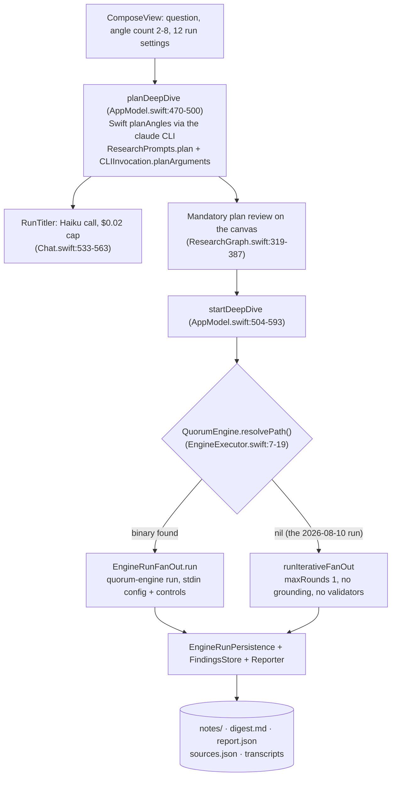

# Current architecture map (as of `4f16287`, 2026-10-09)

Supporting research for [PRD 10](10-architecture-rethink.md), §0 and §1. This is a read-only survey of:
- the code
- `engine/PROTOCOL.md` (v4)
- PRDs 00–09
- the 2026-08-10 validated run
- P1's findings (`docs/reliability/p1-findings.md`, PR #6)

File references are `path:line` on `4f16287`. PR #6 has since changed engine resolution and the handshake (§3).

## 1. Components and sizes

| Part | Where | Files | Lines | Tests |
|---|---|---|---|---|
| UI target | `Sources/Quorum` | 26 | 8,152 | — |
| Logic | `Sources/QuorumCore` | 35 | 6,963 | 46 files, 8,057 lines, 547 tests (578 after PR #6) |
| Engine | `engine/src` | 23 | 5,466 | 19 files, 5,348 lines, 350 tests (355 after PR #6) |
| Protocol spec | `engine/PROTOCOL.md` | 1 | 361 | — |
| Packaging | `scripts/bundle-engine.sh` | 1 | 29 | none |
| CI | `.github/workflows/tests.yml` | 1 | — | runs `swift test` only |

## 2. How a run executes today

**The dispatch** (`AppModel.swift:533-593`). It computes `engineBin = QuorumEngine.resolvePath()`, then branches
on `if mock || (engineBin != nil && !isDry)`:
- **Engine path.** Every profile goes this way, Subscription included, through the engine's `claude-code` backend.
- **Fallback path.** `runIterativeFanOut(..., maxRounds: 1, autoresearch: false)`, stamped
  `pipeline: .inProcess`. The only signal is a non-blocking orange row, `Preflight.engineNotice`
  (`Views.swift:378`).

**Planning always happens in Swift**, even on the engine path:
- `planDeepDive` calls `makeEngine` → `planAngles` (`FanOut.swift:15`).
- The engine's own `defaultPlanAngles` (`run.ts:154`) only picks from 6 fixed facets, and it never runs, because
  the app always sends pre-approved `angles`.
- Every profile needs a Claude CLI preflight, Codex included (`AppModel.swift:472`).

## 3. Engine resolution and the handshake

**Before PR #6:**
- `QuorumEngine.resolvePath()` looks in two places only:
  1. `QUORUM_ENGINE_BIN`, if it's executable
  2. `Bundle.main`'s `quorum-engine`
- There is no PATH search, by design.
- Under `swift run`, `Bundle.main` is `.build/<arch>/debug/`, and nothing ever puts the engine there.
  `scripts/bundle-engine.sh <app>` copies it into an `.app`, but no script builds an `.app`.
- The only local binary, `engine/dist/quorum-engine` (2026-07-15), speaks **protocol v1**. It predates the
  `run` command.
- The protocol check reads `run_start.protocol_version` (`EngineRunFanOut.swift:115-122`):
  - A newer version gets the process terminated (176-184).
  - An older or missing version keeps running, with a "stale engine" badge (`RunPipeline.swift:39-44`).
  - Per-topic `EngineExecutor` streams aren't checked at all.

**After PR #6 (P1):**
- `quorum-engine version` prints one JSON line (`engine`, `engine_version`, `protocol_version`, `build`).
  `bundle-engine.sh` stamps `build` as the git sha, plus `-dirty`.
- `EngineResolution` (QuorumCore, pure, tested) probes the override, then the bundle, then the checkout's
  `engine/dist`. It takes the first binary whose protocol **equals** the supported one, and records why each
  other binary was rejected.
- report.json records `pipeline.engineVersion/build/protocolVersion`, or `fallbackReason`.
- The fallback is loud everywhere, but it still exists.

## 4. The engine `run` pipeline

Defaults (`run.ts:131-143`), which are BYOK-shaped:
- model `deepseek/deepseek-chat`
- 3 angles
- $0.25 per topic, $1 per run
- 300 s per topic
- round cap 4
- 4 angles at once
- verify cap $0.05
- 15% validation reserve
- 300 s approval window

| Stage | Code | Emits |
|---|---|---|
| Start | `run.ts:252` | `run_start{protocol_version:4, grounding}`. **No `engine_version`.** |
| Planning | 717-736 | `phase:planning`, `plan`, root and inquiry `graph_node`s. Pre-approved `angles` skip `planFn`. |
| Research wave | 444-476, 744 | Per angle: `angle_status`, live `stream_event`/`assistant`/`usage`/`document`, then `groundAngle` (338) → `topic_result`. CLI angles' `document` events arrive only after the angle ends (322). Budget per angle: min(perTopic, remaining/(queue+inFlight+2)), halved per spawn depth. |
| Synthesis | 763-792 | `phase:synthesizing`, streamed as `angle_id:"synthesis"` |
| Grounding | 562-612, 794 | Deterministic quote location. Untraceable URLs get one `verify` call. |
| Validation | 614-638, 798-804 | <ul><li>Claim sweep: ≤10 claims per batch, $0.05 each.</li><li>3 blind critics (coverage, conflicts, sources), $0.10 each, run in parallel (`validate.ts:102-153`).</li><li>The sweep is skipped when grounding is `none` (`validate.ts:103`).</li></ul> |
| Objection rounds | 811-837 | Blocking objections and reported conflicts are admitted by `gate.admit` and become `origin:"objection"` questions → `round` |
| Reconcile | 640-667 | Only when there were ≥2 rounds, they diverged, and budget remains → `topic_result{reconciled:true}` |
| End | 862-874 | `phase:done`, `run_result{status, grounding, topics, documents, capture_failures, citation_orphans, validation}` |

**What the app passes** (`AppModel.swift:562-575`, `EngineRunFanOut.swift:17-83`):
- the question, angle count, angles, and three models
- effort, both budgets, timeout, maxTurns
- `priorNotesExcerpt` and the template
- `rounds` (4)
- project context
- `evidenceDir` and `spawnDir`
- `spawnMode:"ask"`
- `runDeadlineSec` = timeout × rounds
- `approvalWindowSec:300`

There's no validator on/off switch, and no `autoresearch` in the engine. Autoresearch exists only in the
fallback (`FanOut.swift:197-252`).

**The client has to reassemble the answer.** It picks the `reconciled:true` topic, or else the last synthesis,
and parses findings, citations, conflicts and gaps out of the fenced JSON inside markdown. It also rebuilds the
graph from deltas. Swift files each round from `topic_result` and uses `run_result` only for validation and
evidence (`EngineRunPersistence.swift:47-54`).

## 5. Backends and the evidence gate

| Backend | Code | Notes |
|---|---|---|
| `claude-code[/alias]` | `claudeCode.ts:94-123` | `claude -p --output-format stream-json --permission-mode dontAsk --max-budget-usd --max-turns --tools`. Cost is the CLI's notional `total_cost_usd`. |
| `codex[/alias]` | `codex.ts:122-150` | `codex exec --json -s read-only`. No spend or turn cap; `cost_usd` is 0. |
| anything else (BYOK) | `agent.ts:63` | AI SDK loop with in-process `web_search`/`web_fetch` and capture straight into the angle's store |

**Evidence capture is gated on a search key, not on `evidenceDir`:**
- `groundingTier(env)` is `hasSearchKey(env) ? "captured" : "none"` (`config.ts:8-14`).
- With no Tavily or Brave key, `claudeCode.ts:87` gives the CLI built-in `WebSearch`/`WebFetch`, no
  `--mcp-config` and no `spawn_inquiry`.
- Built-in tools return content only to the model, so nothing is snapshotted. That means `grounding:"none"` →
  the claim sweep is skipped → `unvalidated`.
- The Swift side always sets `evidenceDir` (`EngineRunFanOut.swift:73-80, 148`), so that was never the blocker.

**Fetching needs no key.** `SearchClient.fetch` calls Jina Reader `r.jina.ai` unauthenticated and falls back to
a plain fetch plus `stripHtml` (`search.ts:131-160`). Only search needs a key. The MCP `web_fetch` (`mcp.ts:51-70`)
lacks the 12k-character `offset` paging, so PROTOCOL's "read parity" holds only on BYOK.

P1's live run (Haiku, 1 angle, 48 s, $0.32) confirmed the consequence: the crew ran, then the run ended
`inconclusive` with 2 blocking objections, both saying no evidence was captured.

## 6. Spawning and human approvals

**Spawning:**
- `spawn_inquiry` is offered to research angles unless the mode is `off`. The default is `ask`, on both sides.
- On the CLI, `mcp-serve` appends requests to `spawn-requests.jsonl` (`spawnLog.ts:21-27`). The engine drains
  them when an angle finishes (`run.ts:527-543`).
- The app files `origin:"dig"` requests there too (`AppModel.swift:647-650`).
- Gates (`spawn.ts:11-17, 223-252`):
  - depth 3
  - 2 children per inquiry
  - 12 per run
  - Dice dedup ≥0.62
  - a freeze at 70% of the deadline
  - headroom against actual spend

**Nothing blocks, by design:**
- `drainControls` uses `take(0)` (`run.ts:493`).
- An offer filed by a wave's last angle can never be approved in time (`run.test.ts:568`).

**The human surfaces:**
- the stdin `approve`/`prune`/`retry` channel (`EngineRunFanOut.swift:161-170, 203-210`)
- `RunControl`
- `PendingApprovals`
- approval cards and Approve all (`ResearchGraphView.swift:228-245, 816-831`)
- `DigDownSheet`
- the "waiting on you" sidebar entry and menu-bar count
- a notification

**The mandatory pre-run plan gate:**
- `AppModel.swift:137-145, 504`
- `researchCTA` (`ResearchGraphView.swift:419`)
- "Nothing runs until you review" (`Views.swift:422`)

## 7. Artifacts and their writers

Everything lives under `<project>/Quorum/`. On the owner's machine the project is the code repo itself.

| Artifact | Contents | Written by |
|---|---|---|
| `queue.json` | Per-project settings | `AppModel.swift:772-785` |
| `notes/<slug>[-n].md` | One durable note per topic: dated sections, frontmatter, footnotes | `FindingsStore.swift:63, 262-324, 584-592`; edits from `MarkdownView.swift:162` |
| `runs/<title> <yyyy-MM-dd-HHmmss>/` | The run folder, **named after the title** | `FindingsStore.swift:64, 70-75` (`RunFolder` 8-32), created at `AppModel.swift:512`; renamed by `RunTitler` (`Chat.swift:566-595`) |
| `…/digest.md`, `report.json`, `sources.json` | Run summary, entries, ledger | `writeDigest` (`FindingsStore.swift:449-463`), called from `EngineRunFanOut.swift:197` and `FanOut.swift:122, 287` |
| `…/<q-slug>-<id6>.transcript.md` | Topic transcript | `FindingsStore.swift:174` |
| `…/<angle-slug>-angle-N.md` (+ `.transcript.md`) | Angle writeups | `FindingsStore.swift:205-212, 241-246` |
| `…/*-synthesis-*.transcript.md`, `*-reconciliation-*.transcript.md` | Synthesis and fuse transcripts | `FindingsStore.swift:215, 265` |
| `…/evidence/documents.jsonl`, `sources/<id>.md\|.pdf` | Captured sources | the engine and each `mcp-serve` child (`evidence.ts:326-341`) |
| `…/evidence/spawn-requests.jsonl` | Filed spawns | `mcp-serve`, `AppModel.swift:650` |
| Benchmark output | Its own folder | `Benchmark.swift:209-254, 450-519` |

That is **six content artifacts per run from five writers**, with no authoritative one. The 2026-08-10 run shows
the consequences:
- Its folder is named after the clarifier.
- Angle `transcriptPath == notePath`.
- Footnote markers have no definitions.
- "Sources" reads 3 in the digest and frontmatter, against 17, 20 and ~45 elsewhere.

## 8. Logic duplicated across the language boundary

| Concern | Swift | Engine | Drift observed |
|---|---|---|---|
| Prompts | `ResearchPrompts.swift` (195) | `systemPrompt.ts` (98) + `run.ts` | P1 had to fix the language rule in both and pin it with a cross-language `prompt-contract.json` |
| Planner | `planAngles`, `CLIInvocation.planArguments`, `ResearchPrompts.plan` | `defaultPlanAngles` (fixed facets, unused) | The engine has no LLM planner |
| Presets | `GuardrailMapper.spec`: Draft/Standard/Deep/Max = $0.15/$1, $10/$40, $15/$60, $20/$80 (`GuardrailMapper.swift:42-64`) | BYOK defaults (`run.ts:131-143`) | Tiers have no single home |
| Output parsing | `ResearchOutputParser` (358), **used on the engine path** by `RunStreamParser` (`:100, :190`) and `EngineRunFanOut` (`:244`) | `parseFencedJson` (`agent.ts`) | It's why PROTOCOL.md keeps the stream "consumable UNCHANGED by the Swift parser" |
| Quote matching | `QuoteLocator` (284) | `evidence.ts` | PRD 07 had to mandate "the same matcher rule" on both sides |
| Graph | `ResearchGraph.from(report:)`, consumer-derived nodes | Orchestrator graph deltas | Two accounts of one run |
| Source counting | `Reporter.distinctSources` (`Reporter.swift:11-43`) plus 5 sites that trust the model's `sourcesConsulted` | Fenced `sourcesConsulted` | RUN-VALIDATION §5 |
| Reconciliation | `reconcile`/`writeReconciliation` (fallback only) | `reconcile.ts` | — |
| Fixtures | `Tests/QuorumCoreTests/Fixtures/` (still v3) | `engine/fixtures/` (v4) | Hand-copied and stale |
| Autoresearch | `FanOut.swift:197-252` | none | A fallback-only feature |

## 9. Where the numbers and names come from

**Source counts.** The canonical `Reporter.distinctSources` is called from:
- `FindingsStore.swift:180, 206, 226, 278`
- `FanOut.swift:153, 341, 776-780`
- `EngineRunPersistence.swift:96`

These sites use the model's self-reported number instead:
- `ResearchOutputParser.swift:172`
- `ResearchStream.swift:61, 81`
- `RunStreamParser.swift:113`
- `Supervisor.swift:71, 158`
- the Benchmark (`Benchmark.swift:318, 342`)

`sourcesConsulted` appears on 68 lines of Swift in total.

**Titles.**
- `RunTitle.from/fromQuestion` (`RunTitle.swift:14-34`) sanity-checks a Haiku reply (`RunTitler`, started at plan
  time, `AppModel.swift:486`). The result becomes the folder name (`:512`).
- Note frontmatter uses `RunTitle.fromQuestion` (`FindingsStore.swift:273, 295, 313`).
- The detail view's navigation title shows the date (`prettyRunName`, `Views.swift:677`).
- That's three names for one run on one screen (UX AUDIT step 9).

**Presets and profiles:**
- Presets: `Models.swift:16-32`. Templates: `Models.swift:37-84`.
- Profiles Subscription/Budget/Full BYOK/Codex/Benchmark: `RunProfile.swift:61-162`.
- `ModelChoice`: `AppModel.swift:9-64`. `makeEngine`/`effectiveProfile`: `AppModel.swift:350-389`.
- The BYOK pane and keys: `QuorumApp.swift:95-161`, `Keychain.swift:54-127`.

## 10. Dead code found during the survey

- `WriteupContent` (`Views.swift:815-825`)
- `CodexCLIProbe` (`MacServices.swift:175`)
- `Reporter.distinctSources(_ entries:)` (`Reporter.swift:28`), which nothing in `Sources` calls
